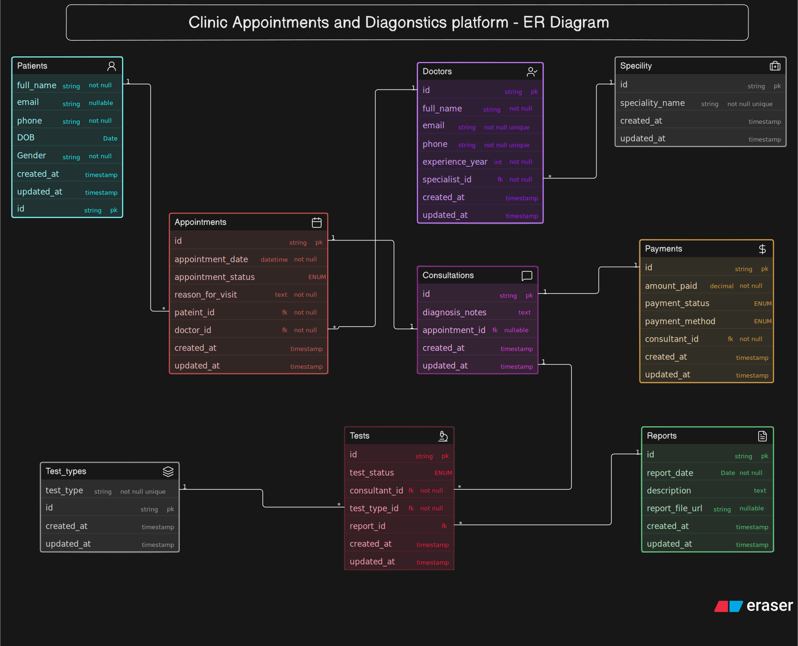

# Clinic Appointment & Diagnostics Platform — ER Diagram

## Overview

This ER diagram models the backend database for a clinic appointment and diagnostics platform. The system manages patients, doctors, appointments, consultations, diagnostic tests, reports, and payments. It is designed for a modern outpatient clinic where patients can book appointments, consult doctors, undergo diagnostic tests if prescribed, receive reports, and complete payments.

The design focuses on keeping the appointment lifecycle separate from the medical consultation, while allowing consultations to generate multiple diagnostic tests whose reports may become available at a later time.

---




> Diagram source code: [`schema.eraser`](./schema.eraserdiagram) — paste this back into Eraser.io to view or edit the diagram directly.

---

# Entities

| Entity            | Purpose                                                                                                                                                              |
| ----------------- | -------------------------------------------------------------------------------------------------------------------------------------------------------------------- |
| **Patients**      | Stores patient information such as personal details and contact information. A patient can book multiple appointments over time.                                     |
| **Doctors**       | Stores doctor information including contact details, years of experience, and medical specialty. A doctor can attend many appointments.                              |
| **Speciality**    | A reusable lookup table containing medical specialties (e.g., Cardiology, Dermatology). Multiple doctors can belong to the same specialty.                           |
| **Appointments**  | Represents appointment bookings between patients and doctors. Stores appointment date, status, and the patient's reason for the visit.                               |
| **Consultations** | Represents the actual doctor visit following an appointment. Stores diagnosis and consultation notes. Not every appointment is required to result in a consultation. |
| **Tests**         | Stores diagnostic tests prescribed during a consultation. Each consultation may prescribe multiple diagnostic tests.                                                 |
| **Test_Types**    | Lookup table containing available diagnostic test categories such as Blood Test, MRI, X-Ray, or ECG.                                                                 |
| **Reports**       | Stores diagnostic reports generated after tests are completed, including report date, description, and an optional file URL.                                         |
| **Payments**      | Records payment details associated with a consultation, including amount, payment method, and payment status.                                                        |

---

# Key Design Decisions

### Appointment and Consultation are separate entities

Appointments represent scheduled bookings, while consultations represent the actual medical visit. Separating these entities reflects real-world clinic workflows where an appointment may be cancelled, rescheduled, or marked as a no-show without ever resulting in a consultation.

---

### Doctors belong to reusable specialties

Medical specialties are modeled as a separate lookup table rather than storing specialty names directly inside the Doctors table. This avoids duplicated values and keeps the schema normalized.

---

### Diagnostic Tests belong to Consultations

Diagnostic tests are prescribed only after the doctor examines the patient. Therefore, tests are linked to Consultations rather than Appointments or Patients. This accurately represents the business process where medical decisions are made during the consultation.

---

### Multiple Tests per Consultation

A single consultation can result in multiple prescribed tests (for example, Blood Test, ECG, and X-Ray). Modeling Tests as a separate entity allows each prescribed investigation to be tracked independently.

---

### Test Types are reusable

Instead of storing test names repeatedly, all available diagnostic test categories are stored in a dedicated Test_Types table. Each test references its corresponding type, improving consistency and reducing data duplication.

---

### Reports are generated separately

Diagnostic reports are modeled independently because they are often generated after the consultation has ended. Reports may contain descriptions, generated dates, and uploaded digital files, allowing the system to support delayed report delivery.

---

### Payments are linked to Consultations

Payments are associated with consultations rather than appointments. This reflects the typical clinic workflow where billing occurs after medical services have been provided, rather than when the appointment is merely scheduled.

---

### Date of Birth instead of storing Age

Patient age is intentionally not stored because it changes over time. Instead, the patient's date of birth is stored, allowing age to be calculated whenever required without introducing stale data.

---

### Lookup Tables improve normalization

Both **Speciality** and **Test_Types** are implemented as lookup tables to eliminate duplicated values, simplify maintenance, and support future expansion without modifying existing records.

---

# Requirement Coverage

| Question                                            | Answered via                    |
| --------------------------------------------------- | ------------------------------- |
| Who are the doctors and what are their specialties? | Doctors + Speciality            |
| Which patient booked which appointment?             | Appointments                    |
| What was the appointment status?                    | Appointments.appointment_status |
| Did the appointment result in a consultation?       | Consultations                   |
| Can one patient have many visits?                   | Patients → Appointments         |
| Can one doctor attend many patients?                | Doctors → Appointments          |
| Can one consultation prescribe multiple tests?      | Consultations → Tests           |
| Which diagnostic tests were prescribed?             | Tests + Test_Types              |
| What reports were generated?                        | Reports                         |
| How are payments recorded?                          | Payments                        |

---

# Database Flow

```
Patient
    │
    ▼
Appointment
    │
    ▼
Consultation
    │
    ├────────────► Payment
    │
    ▼
Diagnostic Tests
    │
    ▼
Reports

Doctor
    │
    ▼
Appointment

Speciality
    │
    ▼
Doctor

Test_Type
    │
    ▼
Tests
```

---

# Design Goals

* Keep appointment scheduling separate from medical consultations.
* Support multiple clinic visits for every patient.
* Allow doctors to manage appointments across different specialties.
* Support multiple diagnostic tests within a single consultation.
* Store reports independently so they can be generated after tests are completed.
* Maintain a normalized database by using reusable lookup tables.
* Keep the schema simple, scalable, and appropriate for a clinic-level management system without introducing unnecessary hospital-level complexity.
