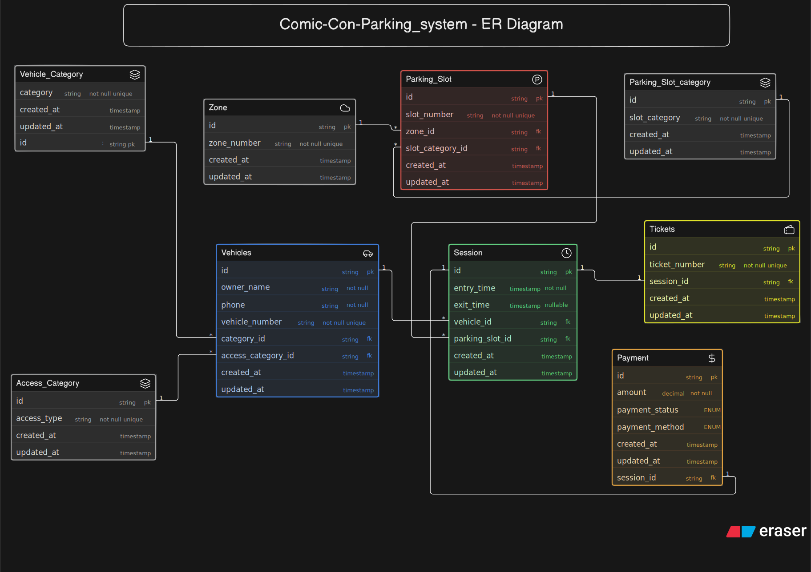

# Comic-Con Parking System — ER Diagram
 
## Overview
 
This ER diagram models the parking management system for a large Comic-Con India venue. The venue spans multiple zones with vehicles entering across multiple event days, using bikes, cars, SUVs, cabs, and EVs. Some parking spots are reserved for special categories — VIP guests, staff, exhibitors, and cosplayers with props — while others support EV charging or general public use.
 

> Diagram source code: [`schema.eraser`](./schema.eraserdiagram) — paste this back into Eraser.io to view or edit the diagram directly.
 
## Entities
 
| Entity | Purpose |
|---|---|
| **Vehicles** | Stores the vehicle + owner details. Each vehicle is uniquely identified by its vehicle number, so the same vehicle can be linked to multiple visits across different event days. |
| **Vehicle_Category** | Lookup table for vehicle types — Bike, Car, SUV, Cab, EV. |
| **Access_Category** | Lookup table for visitor privilege level — Regular-Guest (default), VIP, Staff, Exhibitor, Cosplayer-with-props. |
| **Zone** | Represents a physical zone/level within the venue. Groups multiple parking slots together. |
| **Parking_Slot** | An individual physical parking spot. Belongs to exactly one Zone and one Parking_Slot_category. |
| **Parking_Slot_category** | Lookup table for what a slot is reserved for — General, VIP, Staff, Exhibitor, EV-Charging, Cosplayer-with-props. |
| **Session** | The core tracking record for one parking visit — stores entry and exit timestamps, and links the vehicle to the slot it used. |
| **Tickets** | The receipt/reference issued for a session. One-to-one with Session. |
| **Payment** | The fee and payment status for a completed session. One-to-one with Session. |
 
## Key Design Decisions
 
- **Vehicle vs. Vehicle_Category / Access_Category**: vehicle type (Bike/Car/SUV/...) and visitor privilege (VIP/Staff/...) are two independent dimensions, so they're modeled as two separate foreign keys on Vehicles rather than one combined field. A staff member could drive any vehicle type, and vice versa.
- **Foreign key direction follows the "many" side**: a Parking_Slot is reused across many Sessions, and a Vehicle can have many Sessions (multiple visits across days), so `vehicle_id` and `parking_slot_id` live on the **Session** table, not the other way around. This is what allows one slot/vehicle to be reused indefinitely without duplicating rows.
- **No stored availability flag**: parking availability isn't stored as a boolean anywhere. It's derived by checking whether a Session exists for a given slot with `exit_time IS NULL` (i.e., still open). Storing a separate flag would risk going out of sync with the actual session data, so it's computed instead of cached. The same logic answers "which vehicles are currently parked inside the venue?" — just filtered by vehicle instead of by slot.
- **Ticket and Session are separate, linked one-to-one**: a Session is the system's internal tracking record (created the moment a vehicle is detected entering); the Ticket is the issued reference/receipt tied to that session via `session_id`.
- **Payment is separate from Ticket**: payment only happens after exit, once the fee is calculated from the session's entry/exit timestamps — so Payment links directly to `session_id`, independent of the Ticket.
- **Categories as lookup tables, not ENUMs**: Vehicle_Category, Access_Category, and Parking_Slot_category are modeled as proper reference tables (rather than hardcoded ENUM fields) since they represent reusable, extensible classification data referenced from multiple places.
## Requirement Coverage
 
| Question | Answered via |
|---|---|
| What vehicles entered / what type? | `Vehicles` → `Vehicle_Category` |
| Which spot was assigned, and which zone? | `Session.parking_slot_id` → `Parking_Slot.zone_id` |
| Was the spot reserved (VIP/Staff/Exhibitor/EV)? | `Parking_Slot.slot_category_id` |
| Entry / exit time? | `Session.entry_time` / `exit_time` |
| Ticket issued for the session? | `Tickets.session_id` |
| Can a vehicle visit multiple times? | `Vehicles` (1) → `Session` (many) |
| Can a slot be reused across sessions? | `Parking_Slot` (1) → `Session` (many) |
| Parking availability? | Derived: slot has no open Session |
| Currently parked vehicles? | Derived: Session where `exit_time IS NULL` |
| Charges & payment status? | `Payment.amount`, `payment_status` |
| Special access categories represented? | `Access_Category` on `Vehicles` |
