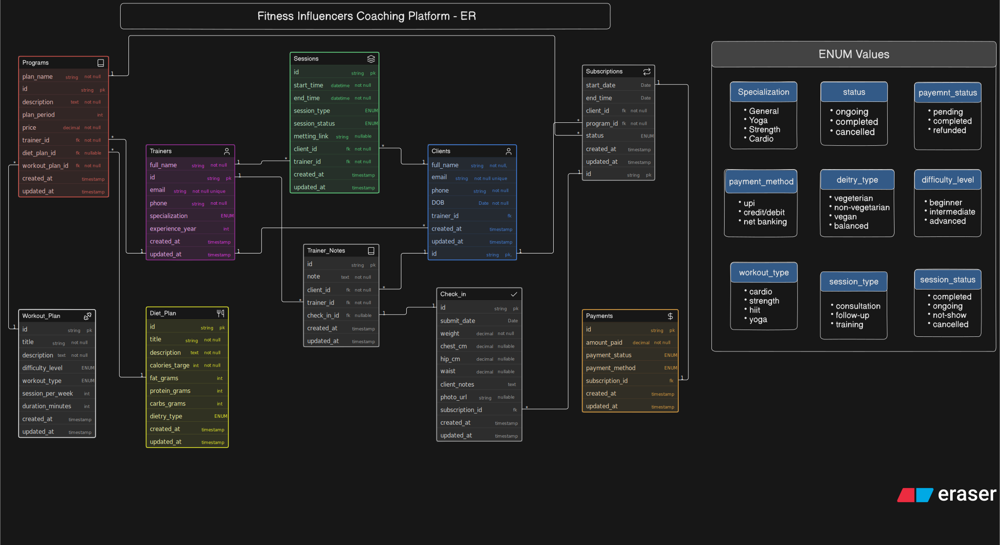

# Fitness Influencer Coaching Platform — ER Diagram
 
## Overview
 
This ER diagram models the backend database for an online fitness coaching platform, where one or more trainers manage multiple clients through structured coaching programs, live sessions, and progress check-ins. This is explicitly **not** a gym management system — there's no equipment or facility tracking. It's an online coaching ecosystem covering consultations, subscriptions, diet/workout guidance, and progress tracking.
 

 
> Diagram source code: [`schema.eraser`](./schema.eraserdiagram) — paste this back into Eraser.io to view or edit the diagram directly.
 
## Entities
 
| Entity | Purpose |
|---|---|
| **Clients** | The people receiving coaching. Each client has a directly assigned trainer for simplicity. |
| **Trainers** | The coaches/influencers running the platform. One trainer can coach many clients. |
| **Programs** | A coaching offering created by a trainer (e.g., a 12-week strength program), optionally bundling a Diet_Plan and/or Workout_Plan. |
| **Diet_Plan** | A reusable diet template (calorie target, macros) — can be attached to multiple Programs. |
| **Workout_Plan** | A reusable workout routine template — can be attached to multiple Programs. |
| **Subscriptions** | The junction entity resolving the many-to-many relationship between Clients and Programs — records which client bought which program, and when. |
| **Payments** | The amount paid and payment status for a subscription. One-to-one with Subscriptions. |
| **Sessions** | A scheduled live call between a client and trainer (consultation, training, or follow-up) — exists independently of Subscriptions, since some clients only ever book a consultation. |
| **Check_in** | A periodic, client-submitted progress report (weight, measurements) tied to a specific Subscription. |
| **Trainer_Notes** | Standalone trainer feedback about a client — can optionally reference a specific Check_in, but doesn't require one. |
 
## Key Design Decisions
 
- **Client ↔ Program is many-to-many, resolved via Subscriptions**: a client can buy multiple programs over time, and a program can be bought by many clients. Subscriptions is the junction table carrying `start_date`, `end_date`, and `status`, keeping that relationship clean rather than forcing a direct FK on either side.
- **Sessions are independent of Subscriptions**: some clients only ever book a one-off consultation and never subscribe to a program. If Sessions depended on an existing Subscription, those clients couldn't have any session recorded at all. So Sessions links directly to both `client_id` and `trainer_id`.
- **Check_in links to Subscriptions, not directly to Clients**: unlike Sessions, check-ins are inherently tied to an active coaching engagement — it ties each progress report to the specific program period it belongs to, which matters if a client has done multiple separate subscriptions over time.
- **Trainer_Notes is a standalone entity**: trainer feedback can happen at unpredictable times — not always in response to a check-in. So `trainer_id` and `client_id` are required directly on this entity, with `check_in_id` as an *optional* link for when a note is responding to a specific check-in. By design, one check-in maps to at most one note (kept one-to-one deliberately, for simplicity).
- **Diet_Plan and Workout_Plan are separate, reusable entities, not embedded in Programs**: their attribute sets are structurally different (calories/macros vs. exercises/sets/reps), so combining them into one generic entity would create a pile of irrelevant nullable columns either way. Both are referenced *from* Programs (`diet_plan_id`, `workout_plan_id`), since many different programs can reuse the same diet or workout template.
- **`workout_plan_id` is required, `diet_plan_id` is optional**: a deliberate choice — every program guarantees a workout component, while diet guidance is treated as an optional add-on.
- **Food-item-level nutrition tracking was deliberately left out**: a more granular `Food_Items` + junction table design was considered, but rejected as unnecessary complexity relative to what the brief asks for. Diet content is captured as structured macro fields plus a free-text description instead.
- **`DOB` instead of a stored `age`**: storing age directly would go stale the moment a year passes. Date of birth lets age be calculated on demand whenever needed, and never needs manual updates.
- **One-time payment model**: the brief doesn't specify recurring/installment billing, so Payments is modeled as one-to-one with Subscriptions for simplicity, rather than supporting multiple payments per subscription.
## Requirement Coverage
 
| Question | Answered via |
|---|---|
| Who are the trainers and clients? | `Trainers`, `Clients` |
| What programs exist? | `Programs` |
| Which client purchased which program? | `Subscriptions` |
| When does a plan start/end? | `Subscriptions.start_date` / `end_date` |
| Are consultations/sessions scheduled? | `Sessions` |
| Are clients submitting check-ins? | `Check_in` |
| How is progress tracked? | `Check_in` (weight, measurements) + `Trainer_Notes` |
| Can multiple clients enroll in the same program? | `Programs` (1) → `Subscriptions` (many) |
| Can one trainer handle many clients? | `Trainers` (1) → `Clients` (many) |
| How is payment/subscription info stored? | `Subscriptions` + `Payments` |
