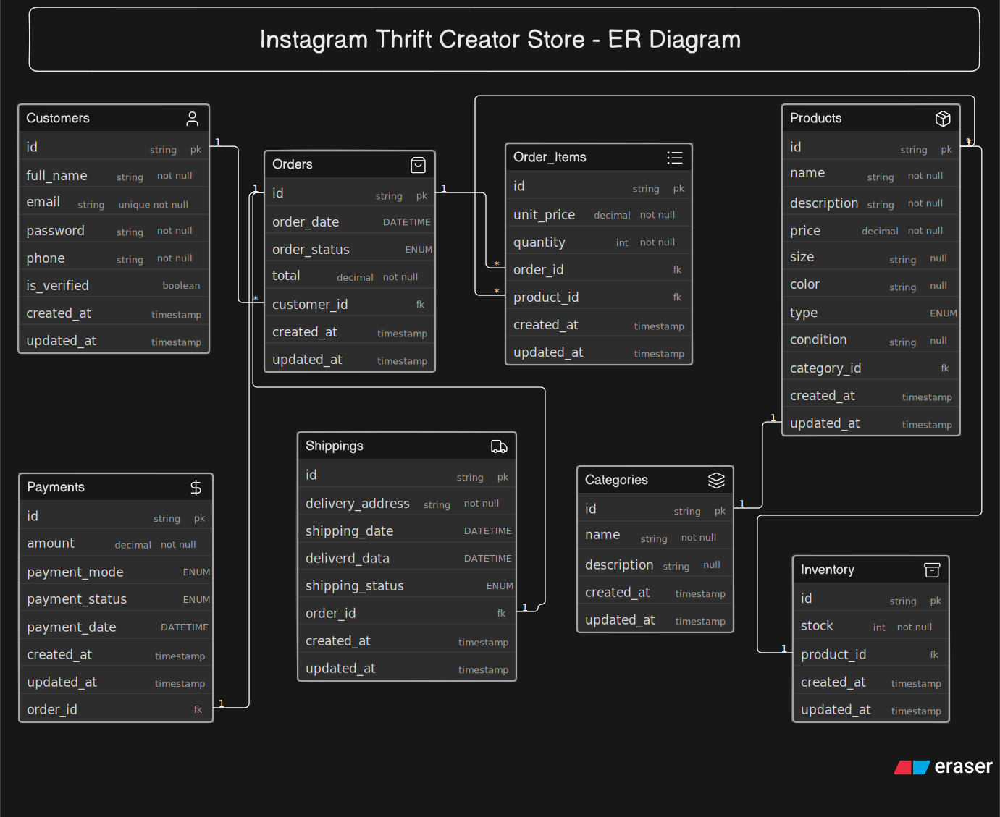

 #Instagram Thrift Creator Store — ER Diagram
 
## Overview
 
This ER diagram models the backend database for a small creator-run Instagram store selling thrifted (secondhand) and handmade fashion items. The design distinguishes between **thrift products**, which are unique one-off pieces, and **handmade products**, which can be produced and stocked in multiple units — while keeping both under a single, consistent product model.
 

 
## Entities
 
| Entity | Purpose |
|---|---|
| **Customers** | Stores customer contact details used for placing and fulfilling orders. |
| **Categories** | Lookup table for product classification (e.g., Dresses, Shoes, Accessories). One category can apply to many products. |
| **Products** | An individual listing — thrifted or handmade — with attributes like size, color, condition, price, and type. |
| **Inventory** | Tracks stock count per product, kept separate from Products for clean separation of concerns. |
| **Orders** | A customer's order, with a snapshot total and status. |
| **Order_Items** | Junction table resolving the many-to-many relationship between Orders and Products — one row per product within an order. |
| **Payments** | Payment amount, mode, and status for a completed order. One-to-one with Orders. |
| **Shippings** | Delivery address, shipping/delivery dates, and shipping status. One-to-one with Orders. |
 
## Key Design Decisions
 
- **Thrift vs. Handmade, without duplicating tables**: rather than building separate structures for thrift and handmade products, both share the same `Products` table, distinguished by a `type` field (Thrift / Handmade). This keeps the schema simple while still capturing the business distinction the brief asks for.
- **`condition` is nullable**: thrifted items have a physical condition (Used-Good, Used-Fair, etc.) since they're secondhand, while handmade items are new and don't need one. Making the field nullable lets one column serve both cases without forcing irrelevant data onto handmade products.
- **Inventory tracks stock generically — `stock = 1` naturally represents a unique thrift piece, `stock = N` represents a handmade batch.** This avoids needing separate logic for "unique" vs. "reusable" inventory; the same column models both, with the business rule (thrift items capped at 1) enforced at the application level rather than forcing extra structure into the ER diagram.
- **Order_Items resolves the Orders↔Products many-to-many relationship**: one order can contain many products, and one product can appear across many different orders — Order_Items is the standard junction table for this, storing `quantity` and a **price snapshot** (`unit_price`) so historical orders remain accurate even if a product's price changes later.
- **Orders.total is a stored snapshot, not just a derived sum**: while it could be recalculated from Order_Items, storing it captures the final amount actually charged at checkout (which may reflect discounts or other adjustments), giving an accurate historical record.
- **Payments and Shippings are separate from Orders**: keeping payment and shipping details out of the Orders table avoids cramming unrelated concerns into one entity, and each connects back via a one-to-one `order_id` relationship.
- **Categories is a separate lookup table, distinct from `type`**: `type` represents a structural business distinction (thrift vs. handmade), while `Categories` represents flexible product classification (e.g., dresses vs. accessories) — two independent dimensions of a product.
## Requirement Coverage
 
| Question | Answered via |
|---|---|
| What products are being sold? | `Products` |
| Thrifted or handmade? | `Products.type` |
| How many pieces available? | `Inventory.stock` |
| Which customer placed which order? | `Orders.customer_id` |
| What items were part of one order? | `Order_Items` (junction table) |
| Was the order paid for? | `Payments.payment_status` |
| Shipped or delivered? | `Shippings.shipping_status` |
| Can a customer place multiple orders? | `Customers` (1) → `Orders` (many) |
| Can an order contain multiple products? | `Orders` (1) → `Order_Items` (many) → `Products` |
| Size, category, color, condition, price? | `Products` attributes + `Categories` lookup |
