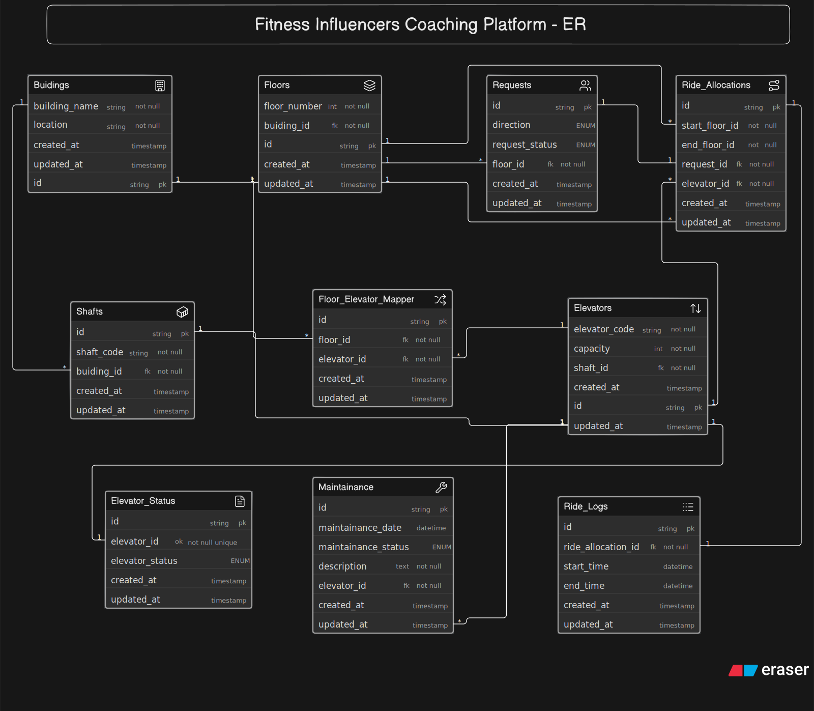

# Smart Elevator Control Platform — ER Diagram

## Overview

This ER diagram models the backend database for a smart elevator control platform used in large commercial buildings such as corporate offices, malls, hospitals, airports, and high-rise residential complexes.

The platform manages multiple buildings, each containing multiple elevator shafts, elevators, and floors. It tracks floor requests generated by passengers, allocates elevators to handle those requests, records completed rides for analytics, monitors elevator status, and maintains maintenance history without overwriting historical data.

The design separates static configuration (buildings, floors, elevators) from operational data (requests, ride allocations, ride logs, maintenance), making the system scalable and suitable for real-time infrastructure management.

---



> Diagram source code: [`schema.eraser`](./schema.eraserdiagram) — paste this back into Eraser.io to view or edit the diagram directly.

---

# Entities

| Entity                    | Purpose                                                                                                                           |
| ------------------------- | --------------------------------------------------------------------------------------------------------------------------------- |
| **Buildings**             | Represents every building connected to the platform. Each building contains multiple floors and elevator shafts.                  |
| **Shafts**                | Represents physical elevator shafts within a building. Each shaft houses one elevator.                                            |
| **Floors**                | Stores all floors belonging to a building. Multiple elevators may serve the same floor.                                           |
| **Elevators**             | Represents elevators installed inside shafts. Stores static information such as elevator code and passenger capacity.             |
| **Floor_Elevator_Mapper** | Junction table resolving the many-to-many relationship between Floors and Elevators, defining which elevators serve which floors. |
| **Elevator_Status**       | Stores the operational status of an elevator (Idle, Moving, Maintenance, etc.) separately from its configuration data.            |
| **Requests**              | Represents floor requests generated by users, including request direction and processing status.                                  |
| **Ride_Allocations**      | Records which elevator was assigned to handle a particular floor request along with the ride's starting and destination floors.   |
| **Ride_Logs**             | Stores ride execution history including start and end timestamps for performance monitoring and analytics.                        |
| **Maintenance**           | Stores maintenance records for elevators, preserving complete maintenance history instead of overwriting previous records.        |

---

# Key Design Decisions

### Buildings contain Floors and Shafts

A building contains multiple floors and multiple elevator shafts. Floors and shafts are modeled as separate entities because they represent different physical components of the building.

---

### Elevators belong to Shafts

Each elevator is installed inside exactly one shaft. Modeling shafts separately reflects real-world building infrastructure and allows additional shaft-related information to be stored in the future if required.

---

### Floors and Elevators have a many-to-many relationship

Not every elevator serves every floor. Some elevators may only operate within specific zones (for example, Floors 1–10 or 11–20). Likewise, multiple elevators can serve the same floor.

This relationship is resolved using the **Floor_Elevator_Mapper** junction table, avoiding redundant data while supporting flexible elevator zoning.

---

### Floor Requests are independent of Elevator Assignment

A floor request simply represents a passenger requesting an elevator from a particular floor and direction (Up or Down). At the time the request is created, no elevator has necessarily been assigned.

The actual elevator assignment occurs later in the **Ride_Allocations** table, keeping request creation independent from scheduling logic and avoiding redundant data.

---

### Ride Allocation is separated from Requests

A request represents passenger intent, while a ride allocation represents the scheduling decision made by the elevator control system.

Separating these entities allows the system to record which elevator handled each request without mixing scheduling logic into the request itself.

---

### Ride Logs are stored independently

Ride execution history is stored separately from ride allocation.

This allows operational analytics such as:

* Number of rides completed today
* Average ride duration
* Elevator utilization
* Peak traffic periods
* Performance reporting

without modifying allocation records.

---

### Elevator Status is separated from Elevator Configuration

The Elevator entity stores static configuration information (code, capacity, shaft), while operational status is stored separately.

Keeping status independent prevents frequently changing operational data from being mixed with long-term configuration data.

---

### Maintenance history is preserved

Maintenance is modeled as a separate entity rather than storing a maintenance flag inside the Elevator table.

This allows every maintenance activity to be recorded independently, preserving complete service history for each elevator.

---

### Start Floor and Destination Floor reference Floors

Ride allocations reference both the starting floor and destination floor using foreign keys instead of storing floor numbers directly.

This ensures rides always reference valid floors within the correct building while maintaining database normalization.

---

# Requirement Coverage

| Question                                        | Answered via                   |
| ----------------------------------------------- | ------------------------------ |
| How many buildings are connected?               | Buildings                      |
| How many elevators exist inside a building?     | Buildings → Shafts → Elevators |
| Which floors belong to which building?          | Floors                         |
| Which elevator serves which floors?             | Floor_Elevator_Mapper          |
| Can multiple elevators serve the same floor?    | Floor_Elevator_Mapper          |
| Can one elevator serve multiple floors?         | Floor_Elevator_Mapper          |
| What requests were generated from which floors? | Requests                       |
| Which elevator handled a request?               | Ride_Allocations               |
| What is the current status of each elevator?    | Elevator_Status                |
| Can an elevator be disabled for maintenance?    | Maintenance                    |
| Can maintenance history be tracked?             | Maintenance                    |
| How many rides were completed?                  | Ride_Logs                      |
| Which requests are still pending?               | Requests.request_status        |
| Which elevator handled the most requests?       | Ride_Allocations + Ride_Logs   |

---

# Database Flow

```text
Building
    │
    ├────────────► Floors
    │                  ▲
    │                  │
    │          Floor_Elevator_Mapper
    │                  │
    ▼                  ▼
Shafts ───────────► Elevators
                        │
         ┌──────────────┼──────────────┐
         ▼              ▼              ▼
 Elevator_Status   Maintenance   Ride_Allocations
                                        ▲
                                        │
                                   Requests
                                        │
                                        ▼
                                   Ride_Logs
```

---

# Design Goals

* Support multiple buildings with multiple elevators.
* Model real-world building infrastructure using shafts.
* Allow elevators to serve configurable floor ranges.
* Keep passenger requests independent of scheduling decisions.
* Separate static elevator configuration from operational data.
* Preserve complete maintenance history.
* Record ride execution history for analytics and reporting.
* Maintain a normalized, scalable schema suitable for large commercial buildings with high daily elevator traffic.
